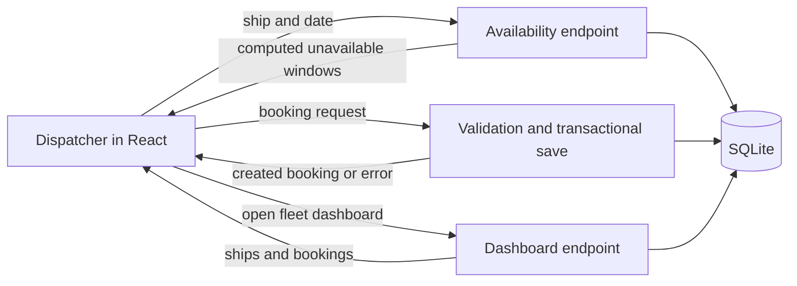

# Implementation walkthrough and path to assessment MVP

Written September 22, 2026. This describes the implementation at commit `1d7bdec` and the recruiter feedback supplied afterward. It separates existing behavior from proposed changes; creating this document does not fix the remaining application gaps.

**September 30 seed update:** the supplied generator is preserved unchanged as `seed_original.py`. The combined `seed.py` produces 6,000 valid bookings in two consecutive 365-day periods: 3,000 with the supplied timing pattern, followed by 3,000 with the aggressive pattern. The second period includes 30- and 31-minute gaps, 06:00 departures, 22:00 returns, and DST transition dates. `--today YYYY-MM-DD` sets the boundary and first aggressive date. The September 22 database observations below remain a historical snapshot; generating new JSON does not reload the database. See the README for current seed commands. The availability display correction described here is still separate pending work.

**Current assessment:** the application runs locally and implements both requested screens, persistence, server-side availability, and protected booking creation. It should not yet be considered ready to submit against the recruiter's clarified expectations. The most important correction is the availability display's refueling buffer, followed by making seeded bookings easy to find and proving they block new bookings through an automated end-to-end test.

## 1. Requirements and recruiter feedback

The [original challenge](rules.md) asks for React, a Python backend, a database, a booking screen, and a fleet dashboard organized by ship. There is no authentication. Bookings must stay within 06:00–22:00 Central Time, must not overlap on the same ship, and must leave at least 30 minutes between consecutive flights. Unavailability must be calculated by the backend. Submission is a public repository link, with code the candidate can explain and modify during an interview.

The recruiter adds a material clarification: **refueling occupies the 30 minutes after a booking, not 30 minutes before and after it.** The feedback also identifies seeded-calendar visibility and the ability to book over existing records as rejection reasons. The comments about UI choices are not specific enough to infer a required visual style or calendar library.

| Requirement or concern | Current implementation | Assessment |
| --- | --- | --- |
| React booking screen | Ship/date selection, time inputs, pilot name, unavailable-window list, submission feedback | Implemented; schedule discoverability needs improvement |
| Dashboard organized by ship | Per-ship booking tables, all dates by default, optional Central date filter | Implemented |
| Persistent seed records | Import command writes the provided ships and bookings to SQLite | Implemented and observed locally |
| Seed bookings visible on the schedule | Date-specific endpoint includes seeded bookings; UI initially opens today | Data path works; historical dates are difficult to discover |
| No overlapping bookings | Server validates all records for the selected ship before saving | Implemented; add an explicit imported-seed conflict regression |
| Simultaneous booking requests | Conflict check and insertion share an immediate SQLite transaction | Implemented; separate-connection concurrency test exists |
| Backend computes unavailability | Server queries, pads, clips, and merges windows; React formats and displays them | Computation is in the required layer |
| Refueling only after a flight | Display endpoint currently pads both ends | **Known mismatch; fix before submission** |
| Central operating hours | Full timestamp comparison against opening and closing on one Central date | Implemented, including rejection of overnight bookings |
| Explainable submission | Runnable project, migration, tests, dependency files, README | Walkthrough below; fresh-clone and final handoff checks remain |

## 2. What was built

### Overall architecture

The initial repository contained disconnected Django model, serializer, and view files. The implementation placed them in a Django application, added project configuration and a migration, completed the seed command, and built a React interface.



Vite serves the frontend during development and proxies `/api` requests to Django on port 8000. This gives the browser a single origin during local development. The database is the local `db.sqlite3` file. The repository does not contain the generated database, virtual environment, frontend dependencies, or build output.

| Component | Purpose and rationale |
| --- | --- |
| React | Implements the two screens with component state and effects; no global state framework is needed for this scope |
| Vite | Development server, API proxy, and frontend production build |
| Luxon | Interprets user-selected clock times in America/Chicago independently of the browser's timezone |
| Django | Database models, migrations, configuration, and management commands |
| Django REST Framework | Request parsing, field validation, JSON serialization, and HTTP responses |
| SQLite | Small local setup; supports the chosen transaction strategy without an external database service |

The tested backend versions are pinned in [requirements.txt](../requirements.txt). Frontend dependencies are recorded in [package.json](../frontend/package.json) and resolved in the committed lockfile. The setup targets Python 3.12 and Node 22.12 or later in the Node 22 line.

### Folder and file map

The repository contains the frontend and backend together. There is no separate `backend/` folder: `spaceport_project/` and `charter_app/` together form the Django backend. They run in the same server process, while `frontend/` contains the browser application and its build tooling.

```text
spaceport-booking/                Repository root; run Django commands here
├── manage.py                     Django command-line entry point
├── requirements.txt              Python dependencies
├── seed.py                       Combined two-period seed JSON generator
├── seed_original.py              Unmodified supplied generator
├── spaceport_project/            Configuration for the whole Django backend
│   ├── settings.py
│   ├── urls.py
│   └── wsgi.py
├── charter_app/                  Ship-booking feature and business rules
│   ├── models.py
│   ├── serializers.py
│   ├── views.py
│   ├── urls.py
│   ├── tests.py
│   ├── migrations/               Versioned database schema changes
│   │   └── 0001_initial.py
│   └── management/               Django custom command package
│       └── commands/             Discoverable command implementations
│           └── load_seed.py
├── frontend/                     React application and npm/Vite configuration
│   ├── package.json
│   ├── package-lock.json
│   ├── index.html
│   ├── vite.config.js
│   └── src/                      Frontend source code and helper tests
│       ├── main.jsx
│       ├── style.css
│       ├── time.js
│       └── time.test.js
├── analysis/                     Seed validity and utilization investigations
│   ├── test_seed.py
│   ├── seed_utilization.py
│   └── test_seed_utilization.py
└── documentation/                Challenge rules, explanations, and MVP plan
```

This tree highlights source organization; it omits some small files such as `__init__.py` and runtime-version settings.

#### What each folder means

| Folder | Purpose | When you would work here |
| --- | --- | --- |
| Repository root (`spaceport-booking/`) | Holds shared setup instructions, Python dependency/runtime files, `manage.py`, and the supplied seed generator. It is also the default location of the local SQLite database. | Installing the backend, running Django commands, or changing project-wide documentation |
| `spaceport_project/` | The Django **project** package: configures the backend as a whole, registers installed apps, sets database/timezone options, and connects the root URL routes. `wsgi.py` exposes the server application to a WSGI host. | Changing configuration, database connections, or top-level routing |
| `charter_app/` | The Django **app** package: implements the ship-booking feature through models, validation, request handlers, and tests. It is registered in the project's `INSTALLED_APPS`. | Changing booking rules, API behavior, or the data model |
| `charter_app/migrations/` | Contains executable, versioned instructions for creating or changing database tables. Django tracks which migrations have been applied to each database. These are committed source files, not copies of booking data. | After changing models: generate a migration with `makemigrations`, inspect it, and apply it with `migrate` |
| `charter_app/management/` | The conventional package Django uses for an app's custom command organization. It does not implement the Fleet Manager screen. | Organizing backend command-line utilities |
| `charter_app/management/commands/` | Contains the actual custom commands. Django discovers `load_seed.py` here and makes it available as `python manage.py load_seed`. The nested location is required by Django's command discovery convention. | Changing seed import behavior or adding another maintenance command |
| `frontend/` | The frontend's own package root: npm dependencies, lockfile, HTML entry point, and Vite configuration live here. Run `npm ci`, `npm run dev`, and `npm run build` from this folder. | Managing frontend dependencies, build settings, or the development API proxy |
| `frontend/src/` | Contains the JavaScript/JSX and CSS that implement the user interface. Both screens currently live in `main.jsx`; shared time helpers and their tests live alongside it. | Changing forms, schedule presentation, dashboard rendering, or browser time formatting |
| `documentation/` | Contains the original assessment and explanatory Markdown. These files are for developers and reviewers; the application does not load them at runtime. | Updating requirements notes, implementation explanations, or the remaining-work plan |

The **project/app distinction** is the reason for the two Python folders. `spaceport_project/` decides how Django is configured and which features it loads. `charter_app/` implements this application's feature. For example, a request to `/api/bookings` passes through the project URL configuration, then the app URL configuration, then the app's booking handler. Adding another feature later could mean adding another Django app under the same project, not starting another server.

The `__init__.py` files mark the relevant directories as Python packages. They may be empty: their purpose here is package organization and discovery, not booking behavior. Folder names such as `spaceport_project` and `charter_app` are our choices, provided imports and configuration agree; the nested `management/commands/` layout is a Django convention.

#### Generated and hidden folders

These are distinct from the source folders above. Some appear only after setup or running the application.

| Folder | Created or maintained by | How to treat it |
| --- | --- | --- |
| `.git/` | Git | Repository history and metadata; use Git commands rather than editing it manually |
| `.venv/` | Python environment setup | Isolated Python runtime environment and installed backend packages; ignored by Git and recreated from setup instructions |
| `frontend/node_modules/` | `npm ci` or `npm install` | Installed frontend dependencies; ignored by Git, not application source to edit |
| `frontend/dist/` | `npm run build` | Generated deployable frontend files; ignored by Git. Edit `src/` and rebuild rather than editing this output |
| `__pycache__/` inside Python folders | Python during execution | Compiled bytecode caches; ignored by Git and regenerated automatically |

`db.sqlite3` and `seed.json` are **files**, not folders. The former contains local persisted records; the latter is generated input for the seed command. Both are ignored by Git. Removing the database loses local bookings unless you have a backup; regenerating/importing seed data is a reset, not recovery of user-created records. In contrast, `migrations/`, `requirements.txt`, and `frontend/package-lock.json` belong in version control so another developer can recreate the schema and install dependencies.

#### Individual files

| File | Responsibility |
| --- | --- |
| [manage.py](../manage.py) | Entry point for migration, seed, test, and server commands |
| [settings.py](../spaceport_project/settings.py) | Installed apps, timezone, SQLite settings, JSON API defaults, and local host configuration |
| [project URLs](../spaceport_project/urls.py) | Mounts the application's routes under `/api/` |
| [models.py](../charter_app/models.py) | Ship and Booking database schema, index, and positive-duration constraint |
| [initial migration](../charter_app/migrations/0001_initial.py) | Recreates the schema on a fresh database |
| [serializers.py](../charter_app/serializers.py) | API field mapping, offset validation, operating window, and conflict check |
| [views.py](../charter_app/views.py) | Availability calculation, transactional creation, and dashboard response |
| [app URLs](../charter_app/urls.py) | Endpoint-to-handler mapping |
| [load_seed.py](../charter_app/management/commands/load_seed.py) | Transactional replacement of fleet and booking data from JSON |
| [main.jsx](../frontend/src/main.jsx) | Both screens, form state, requests, and feedback |
| [time.js](../frontend/src/time.js) | Central Time input conversion and display helpers |
| [style.css](../frontend/src/style.css) | Responsive layout, typography, forms, tables, and notices |
| [backend tests](../charter_app/tests.py) and [frontend tests](../frontend/src/time.test.js) | Booking/API regressions and timezone helpers |

### Data model and persistence

`Ship` has an automatically assigned ID and a name. `Booking` has an ID, a ship foreign key, pilot name, start timestamp, and end timestamp. Django uses snake_case internally; the API exposes `shipId`, `pilotName`, `startTime`, and `endTime` as requested.

The ship foreign key keeps bookings tied to real ships. Deleting a ship cascades to its bookings, although the application exposes no deletion endpoint. Pilot names are required, trimmed, and limited to 255 characters through the API. The database also requires `end_time > start_time`.

The compound `(ship, start_time, end_time)` index helps narrow interval searches to the relevant ship and candidate times. It is a performance aid, not an overlap constraint or a universal logarithmic-time guarantee.

Django stores aware timestamps in UTC. Central Time is used for interpreting the spaceport's operating rules and displaying the schedule. Refueling is derived from flight end times; no separate refueling record is stored.

### Booking screen: what happens when a user books

1. React requests the fleet and initially selects the first ship and today's Central date.
2. Selecting a ship or date triggers the dedicated availability endpoint. The result is a list of already-computed unavailable windows plus opening and closing times.
3. The user enters start time, end time, and pilot name. Native form constraints help with required fields and clock bounds; a small client check rejects an end time preceding the start.
4. Luxon combines the selected date and clock times in `America/Chicago`, producing ISO timestamps with the correct offset.
5. React posts the booking. The server performs authoritative validation; browser controls cannot bypass it.
6. Success displays the assigned booking ID and flight times. A failure displays the server's error. The app reloads availability after either result, which also refreshes a stale view after another dispatcher takes the slot.

During a request, the form is disabled. Availability responses for a previous ship or date are ignored when a newer selection has replaced them. This prevents slow requests from replacing the currently selected schedule.

The current schedule is a textual unavailable-window list. It does not show a calendar grid, separate flight/refueling bands, or pilot names alongside those windows. The user can enter conflicting times and receive a server error; there is no server-supplied valid-slot picker yet.

### Fleet dashboard

The dashboard endpoint returns ships and all bookings in two queries. Bookings are ordered chronologically. React groups them under each ship and can filter them using the booking's Central Time date. This client-side grouping is allowed: it is presentation of the dashboard, not calculation of booking-screen unavailability.

Each table shows date, pilot, departure, return, and booking ID. The screen defaults to all dates so historical seed records are included. Refresh reloads the dataset. Approximately 3,000 rows is manageable for the assessment; server-side filtering and pagination are a later scaling improvement.

### API contract

| Method and path | Input | Result |
| --- | --- | --- |
| `GET /api/ships` | None | Array of ship IDs and names |
| `GET /api/bookings/unavailable` | `ship_id` and `date=YYYY-MM-DD` query parameters | Central opening/closing timestamps and computed unavailable windows |
| `POST /api/bookings` | JSON booking fields | HTTP 201 with saved booking, or validation error |
| `GET /api/dashboard` | None | Object containing ships and bookings |
| `GET /api/bookings` | None | Same dataset as the dashboard |

A booking request looks like this:

```json
{
  "shipId": 3,
  "pilotName": "Beverly Crusher",
  "startTime": "2026-09-22T09:00:00-05:00",
  "endTime": "2026-09-22T10:00:00-05:00"
}
```

Invalid booking fields or conflicts return HTTP 400. Availability requests for a missing ship return 404, while malformed parameters return 400. A booking writer that exhausts the SQLite lock timeout returns 503 with a retry message. There is no authentication, as requested.

The server returning timestamps does not itself violate the backend-calculation requirement. The relevant distinction is that React receives **computed unavailable windows** and formats their times. It does not receive raw history and add buffers, merge ranges, or derive free slots from that history.

### Operating hours and timezones

The server converts both input timestamps to Central Time and constructs opening and closing on the start date. It requires:

```text
opening <= start < end <= closing
```

This permits a flight starting exactly at 06:00 or ending exactly at 22:00. It rejects zero duration, negative duration, any end after closing, and overnight or multi-day flights. Inputs without an explicit offset or `Z` are rejected so server-local timezone settings cannot silently reinterpret them.

The UI likewise uses Central Time even if the dispatcher is in another country. Named-zone conversion handles the Central offset for the selected date; hardcoding `-05:00` would be incorrect in winter. API and JavaScript tests include winter, summer, and DST transition dates.

### Concurrency and overlap protection

The booking endpoint enters `transaction.atomic()` before validating the request and stays inside it until insertion completes. The database connection uses SQLite's `IMMEDIATE` transaction mode, reserving the writer before the conflict query.

A second writer waits. After the first writer commits, the second validates against that newly stored booking and rejects a conflicting request. The committed test exercises simultaneous requests through separate database connections and expects exactly one HTTP 201, one HTTP 400, and one saved booking.

This depends on the database configuration and the transaction boundary together. The ORM query alone does not lock a time range. All ships share SQLite's writer reservation, so even unrelated writes serialize; that is an accepted small-application tradeoff. Direct ORM writes and the seed importer do not use booking serializer validation.

### Seed data: generation, import, and visibility

The original generator, now preserved as [seed_original.py](../seed_original.py), starts one year before the generation date and generates up to 600 flights for each of five ships. Its random choices use a fixed seed, but calendar dates depend on the day it runs. Reaching the booking count can stop generation well before today; its records do not necessarily span a complete year. The combined [seed.py](../seed.py) reproduces that pattern inside the first 365-day period, then places 600 aggressive bookings per ship across 60 dates in the immediately following period. This makes the source patterns consecutive without mixing or overlapping them. The following September 22 observations concern the earlier standalone original dataset.

`load_seed` reads the JSON, deletes existing bookings and ships, and bulk inserts replacements inside one transaction. A failed import rolls back those mutations. This is a reset command for the supplied trusted data, not a general validated import API.

Read-only verification on September 22 found **5 ships and 3,000 bookings** in the local database. The earliest start was September 21, 2025 at 12:00 UTC; the latest end was May 26, 2026 at 19:00 UTC. All these records are historical relative to this document's date.

The dashboard endpoint returned all 3,000 records. The availability endpoint returned windows for **Serenity, ship ID 3, September 21, 2025**, confirming that imported data reaches the scheduling query. One flight that day is Beverly Crusher's 07:00–09:30 Central charter. The current endpoint exposes 06:30–10:00 for that flight, which also demonstrates the incorrect leading buffer. Under the clarified rule its occupied/refueling window should be 07:00–10:00.

An empty view today therefore does not prove an import failure. However, requiring an evaluator to discover an old date manually is a real usability problem. Seeded schedules need an obvious navigation path.

### Verification completed and its limits

During implementation, nine backend tests and two frontend tests passed, along with Django checks, migration consistency, and a Vite production build. A temporary browser smoke script also verified successful creation, conflict rejection, dashboard date filtering, a simulated Tokyo timezone, and a mobile viewport without horizontal overflow.

That browser script was temporary tooling, not a committed repeatable browser test suite. It created a new future booking; it did not prove an imported seed record's complete display-and-conflict flow. This documentation pass performed read-only database and endpoint checks, not a fresh run of the entire test suite.

The existing availability test explicitly expects the leading 30-minute buffer. **Passing that test demonstrates the implemented behavior, not compliance with the new clarification.** It must change along with the endpoint. Separate tests of gaps before and after a requested booking should remain.

## 3. Refueling: the correction and the subtle distinction

This is the highest-priority finding from the recruiter's feedback. My earlier implementation used symmetric padding in both the conflict query and the displayed availability calculation. Those two uses have different meanings.

### What the schedule should display

For an existing flight from 12:00 to 13:00:

| Interval | Current display | Required interpretation |
| --- | --- | --- |
| 11:30–12:00 | Unavailable because of leading padding | No refueling belonging to this existing flight |
| 12:00–13:00 | Unavailable | Flight |
| 13:00–13:30 | Unavailable | Refueling after the flight |
| From 13:30 | Outside this blocked window | A following flight may begin |

The backend should calculate occupied time as `[flight.start, flight.end + 30 minutes)`, clipped to the displayed operating day. If the UI separates flight and refueling labels, the backend should supply those intervals explicitly. React should not calculate a missing refueling interval itself.

### Why validation must still check both neighboring gaps

End-only refueling does not mean only checking the preceding existing booking. A newly requested flight also needs its own 30 minutes after it, including when it is being inserted before an existing flight.

For the same existing 12:00–13:00 flight:

| Requested flight | Expected result | Reason |
| --- | --- | --- |
| 10:30–11:30 | Accept | Its refueling ends at 12:00 |
| 11:00–12:00 | Reject | Its own refueling would overlap the existing flight |
| 12:15–12:45 | Reject | Flight overlap |
| 13:00–14:00 | Reject | Existing flight is still refueling |
| 13:30–14:30 | Accept | Exactly 30 minutes after the existing flight |

For existing flight `E` and candidate `C`, comparing their end-buffered occupied intervals yields:

```text
E.start < C.end + 30 minutes
AND
C.start < E.end + 30 minutes
```

The current serializer writes the second condition equivalently as `E.end > C.start - 30 minutes`. That algebra is correct for a single 30-minute gap. It does not impose 60 minutes between flights. Removing the candidate's refueling consideration would introduce a bug when inserting an earlier booking.

The plan is therefore to **fix the displayed occupancy calculation and explain validation in terms of each flight's own trailing buffer**. Do not mechanically delete every subtraction of 30 minutes from the code. Query bounds used to find relevant records also need reasoning about which intervals they are retrieving.

## 4. Ordered next steps to reach MVP

Here, MVP means a working, reproducible assessment submission satisfying the original prompt and the recruiter's clarification. It does not require accounts, payments, cancellations, a cloud deployment, or a large scheduling framework.

### Step 1 — Correct and document the backend availability contract

Change `get_unavailable_slots` to begin each occupied interval at the actual flight start and end it 30 minutes after the flight ends. Review its query bounds, clipping, and merging under that definition. Keep creation protected by the immediate transaction and retain checks against both neighboring flights.

Use one clearly described rule for refueling in the endpoint, serializer comments, UI copy, README, and architecture notes. If separate flight/refueling visuals are introduced, return their already-computed intervals from the backend, optionally alongside merged unavailable windows.

**Done when:** a 12:00–13:00 flight blocks 12:00–13:30 on the schedule; a 13:30 departure succeeds; a preceding flight ending 11:30 succeeds; one ending 12:00 fails. There is no extra leading refueling block and no accidental 60-minute requirement.

### Step 2 — Add the recruiter-specific regression tests

Update the availability test that currently asserts symmetric padding. Add a test that imports seed-shaped data with `load_seed`, retrieves that same record through the dashboard and selected-day availability endpoint, and submits an overlapping booking against it. Assert HTTP 400 and an unchanged row count.

Also cover both sides of the exact 30-minute boundary, different ships at the same time, a newly created booking immediately appearing in availability, and the existing simultaneous-request case. Keep deterministic fixture dates for unit tests; do not depend on today's date matching historical data.

**Done when:** the reported rejection scenarios are reproducible automated checks, including overlap against imported data rather than only records created by the booking endpoint.

### Step 3 — Make the seeded schedule easy to find and read

Add a direct way to open a ship/date from a dashboard booking in the charter screen. This uses the selected booking's ship and Central date to request the availability endpoint; it must not reuse full dashboard history to calculate availability. Make an empty day explain that other dates can contain bookings and provide an obvious route to the fleet log.

A simple day timeline or clearly separated schedule rows can distinguish flight time from its following refueling period. This is a recommendation in response to the recruiter's calendar/UI concern; the original prompt does not mandate a month grid or a specific calendar library. Keep labels, operating hours, and Central Time visible on mobile as well as desktop.

Update the current boundary guidance when replacing symmetric display windows: apparent free time immediately before an existing flight may be too short for a candidate plus its own refueling. If the UI offers selectable valid slots, have the backend compute them for the chosen duration. Do not introduce frontend scheduling arithmetic to make the new UI work.

**Done when:** a reviewer can open a seeded flight's day directly, see the flight and trailing refueling clearly, and attempt a conflicting booking that the backend rejects. An empty view today cannot reasonably be mistaken for missing seed data.

### Step 4 — Commit a repeatable browser acceptance test

Run against a fresh test database loaded with a deterministic fixture. Cover seed visibility on both screens, an overlapping booking rejection, an exact-boundary success, updated availability after creation, and correct ship/date navigation. Check a browser timezone outside Central and a narrow viewport. Assert that the charter flow gets availability from its dedicated endpoint.

Use an isolated database for these tests so they cannot reset a user's working data. A single documented command is enough for this assessment; a large browser-testing framework or extensive CI pipeline is unnecessary.

**Done when:** another developer can reproduce the critical browser checks from the repository, and the same flow works manually with the original generated seed file.

### Step 5 — Perform a fresh-clone rehearsal and align the docs

Follow the README with supported Python and Node versions, install dependencies, migrate, generate/import seeds, and start both servers. Run backend tests, frontend tests, migration checks, the production build, and the browser acceptance flow. Confirm seeded records after a server restart to demonstrate persistence.

Update documentation and screenshots to the corrected behavior. Include a short reviewer path: open the fleet log, open an existing booking's day, try a conflict, then create a valid booking. Record actual verification results and any remaining limitations rather than asserting general production readiness.

**Done when:** no undocumented file, temporary tool, existing database, or cached dependency is necessary to run and assess the application.

### Step 6 — Prepare the submission and technical walkthrough

Review the final changes, commit the completed implementation and documentation, and prepare the public repository handoff required by the prompt. This document does not itself publish anything or send the recruiter a message.

Practice explaining the request flow, end-only refueling math, why validation occurs inside the transaction, why all dates use Central Time, how seeded records enter the same queries as new records, and the limitations of SQLite and bulk seed import. Be prepared to locate each behavior in the files above and make a small modification live.

**Done when:** the submitted repository is the tested version, its instructions work, and the implementation's tradeoffs can be explained without relying on unsupported claims.

## 5. Gotchas and remaining limitations

For the numerical capacity limits and both consecutive periods' occupancy, see [annual capacity and seed utilization](../analysis/capacity-and-utilization.md). The supporting scripts and tests are isolated in the top-level `analysis/` folder. The aggressive period stresses turnaround boundaries on selected days; it does not represent higher annual utilization.

| Gotcha | Practical implication |
| --- | --- |
| Old tests encode the old interpretation | Update the availability assertions; a green suite alone does not settle a clarified requirement |
| Occupied intervals differ from valid candidate slots | End-only displayed occupancy must still account for the candidate's own refueling during creation |
| Refueling after a 22:00 return | Current validation permits the flight to end at 22:00 and clips display to closing. This assumes the operating-hours rule applies to bookings, with refueling allowed after closing; a stricter turnaround rule would change the latest return |
| Entirely historical seed data | Today can be empty even after a correct import. Use actual imported dates and an obvious schedule navigation path |
| Seed dates move when regenerated | The fixed random seed fixes choices, not absolute calendar dates. Document examples as examples, not permanent fixtures |
| `load_seed` resets the database | It replaces user-created bookings too. Use a separate database for tests and only reset intentionally |
| Bulk import bypasses serializer rules | Trusted seed data is assumed. Arbitrary imports would require separate validation; the database alone does not enforce operating hours or exclusion |
| SQLite concurrency depends on settings | A new write endpoint must preserve the transaction-before-validation pattern. Swapping databases requires revisiting the strategy |
| Stale schedules and lost responses | Another user can book after availability is loaded; POST remains authoritative. After a lost success response, check the dashboard before assuming no booking was saved; there is no idempotency-key feature |
| Merged windows lose booking detail | A merged unavailable range cannot show which pilot owns each flight. Supply separate server-calculated display entries if the schedule needs that detail |
| Browser timezone and date grouping | Use America/Chicago for input conversion and grouping, not browser-local dates or the date portion of a UTC string |
| Minute inputs versus precise API timestamps | UI inputs use minute precision; backend comparisons include seconds. Boundary tests should retain second-level cases |
| No restriction on historical bookings | The original prompt does not forbid them. Historical-date tests and demos currently work; do not add a future-only rule implicitly |
| Dashboard loads the full dataset | Reasonable for this challenge; pagination and backend filtering can follow if data volume grows |
| Limited UI error handling | API errors are displayed, but non-JSON proxy failures can surface a JSON parse error. A friendly connectivity message would improve the final polish |
| Local configuration and assets | Debug mode, a development secret, local hosts, Vite proxying, and Google-hosted fonts suit local evaluation. Public hosting needs deliberate configuration; fonts fall back when offline |
| Environment used during implementation | The machine originally had older default Python and Node versions. Verification used isolated newer tooling, some under temporary directories. Those paths are not a durable installation method; the README's supported runtimes are the reproducible setup |

## 6. What can wait until after assessment MVP

Authentication is explicitly excluded. Editing, cancellation, payments, notifications, ship administration, live updates, and recurring bookings are outside the requested scope. Production hosting, stronger deployment configuration, broader import validation, pagination, and a database designed for higher concurrent write volume are possible later work.

The challenge asks for a focused result in roughly two to three hours and an honest note if more time is needed. Prioritize the demonstrated rejection risks: correct trailing refueling, visible seeded schedules, and reliable server-side rejection of conflicts. Record unfinished extras instead of expanding scope before those acceptance checks pass.
