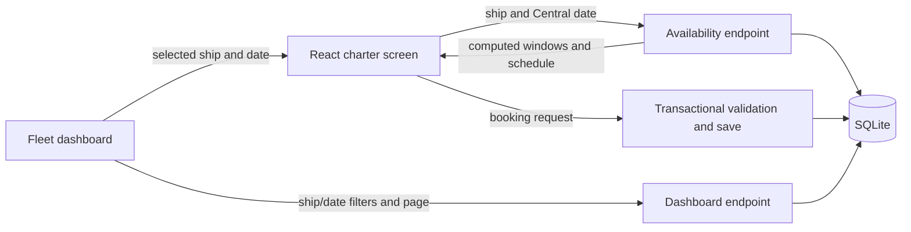

# Implementation walkthrough and MVP status

Updated October 1, 2026 after the backend filtering and pagination audit. This describes the current implementation and records what was already complete, what was finished, and what remains for handoff.

The booking screen now shows each flight followed by its refueling interval, with no leading buffer. Seeded bookings in either year can be opened directly from the dashboard. Both backend and browser regression tests exercise imported records rather than only newly created bookings. See the [README](../README.md) for setup commands and the [verification record](verification.md) for the checks run during this pass.

## 1. Requirements and recruiter feedback

The [original challenge](rules.md) requires React, a Python backend, persistent data, a charter screen, and a fleet dashboard organized by ship. There is no authentication. Each booking must stay entirely within 06:00–22:00 Central on one date, cannot overlap another booking on the same ship, and must leave 30 minutes before the next flight. Availability must be calculated by the backend.

The recruiter clarified that refueling extends only the end of a flight. They also identified missing seeded schedules and successful overlapping bookings as rejection reasons. Their UI feedback did not mandate a calendar library or a particular visual style.

| Area | State before this pass | Current result |
| --- | --- | --- |
| Runnable Django project and React screens | Complete | Retained |
| Operating hours, offset validation, positive duration | Complete | Existing boundary tests retained |
| Conflict checks and simultaneous requests | Complete | Transactional behavior retained; tested against imported records too |
| Seed import, rollback, randomized history and future-week generator | Complete | Complete fixture used in integration and browser tests |
| Availability computation | Implemented, but incorrectly padded before flights | Fixed to departure through flight end plus 30 minutes |
| Flight/refueling detail | Only merged unavailable ranges were shown | Backend now supplies individual flights, pilots, and refueling intervals |
| Dashboard schedule navigation | Missing | Each booking opens its ship and Central date in the charter screen |
| Imported-seed conflict regressions | Partial: import and API creation tested separately | Both years are imported, displayed, and checked for conflicts together |
| Browser checks | A temporary smoke script existed | Repeatable Playwright suite is included in the repository |
| Setup instructions and architecture notes | Present, with outdated buffer claims | Updated to match the implemented behavior |
| Public submission and interview preparation | Not part of implementation | User handoff remains |

## 2. What was built

### Overall architecture

The repository holds the browser application and Python backend together. React handles user interaction and presentation; Django performs scheduling validation and database access. Vite serves React locally and proxies requests under /api to Django. SQLite provides persistent storage with no separate database service.



React uses local state and effects because two screens do not need a separate global state framework. Luxon interprets clock inputs in America/Chicago, regardless of the browser's timezone. Django REST Framework maps API fields, validates requests, and returns JSON. Python dependencies are pinned; the frontend has an npm lockfile. Playwright is a development dependency for browser checks.

### Folder and file map

The repository contains the frontend and backend together. There is no separate `backend/` folder: `spaceport_project/` and `charter_app/` together form the Django backend. They run in the same server process, while `frontend/` contains the browser application and its build tooling.

```text
spaceport-booking/                Repository root; run Django commands here
├── manage.py                     Django command-line entry point
├── requirements.txt              Python dependencies
├── seed.py                       Randomized history and future-week seed generator
├── seed_original.py              Unmodified supplied generator
├── spaceport_project/            Configuration for the whole Django backend
│   ├── settings.py
│   ├── urls.py
│   └── wsgi.py
├── charter_app/                  Ship-booking feature and business rules
│   ├── models.py
│   ├── serializers.py
│   ├── views.py
│   ├── urls.py
│   ├── tests.py
│   ├── migrations/               Versioned database schema changes
│   │   └── 0001_initial.py
│   └── management/               Django custom command package
│       └── commands/             Discoverable command implementations
│           └── load_seed.py
├── frontend/                     React application and npm/Vite configuration
│   ├── package.json
│   ├── package-lock.json
│   ├── index.html
│   ├── vite.config.js
│   ├── e2e/                      Browser scenarios and isolated test backend
│   ├── playwright.config.js      Browser test configuration
│   └── src/                      Frontend source code and helper tests
│       ├── main.jsx
│       ├── style.css
│       ├── time.js
│       └── time.test.js
├── analysis/                     Seed validity and utilization investigations
│   ├── test_seed.py
│   ├── seed_utilization.py
│   └── test_seed_utilization.py
└── documentation/                Challenge rules, explanations, and MVP plan
```

This tree highlights source organization; it omits some small files such as `__init__.py` and runtime-version settings.

#### What each folder means

| Folder | Purpose | When you would work here |
| --- | --- | --- |
| Repository root (`spaceport-booking/`) | Holds shared setup instructions, Python dependency/runtime files, `manage.py`, and the supplied seed generator. It is also the default location of the local SQLite database. | Installing the backend, running Django commands, or changing project-wide documentation |
| `spaceport_project/` | The Django **project** package: configures the backend as a whole, registers installed apps, sets database/timezone options, and connects the root URL routes. `wsgi.py` exposes the server application to a WSGI host. | Changing configuration, database connections, or top-level routing |
| `charter_app/` | The Django **app** package: implements the ship-booking feature through models, validation, request handlers, and tests. It is registered in the project's `INSTALLED_APPS`. | Changing booking rules, API behavior, or the data model |
| `charter_app/migrations/` | Contains executable, versioned instructions for creating or changing database tables. Django tracks which migrations have been applied to each database. These are committed source files, not copies of booking data. | After changing models: generate a migration with `makemigrations`, inspect it, and apply it with `migrate` |
| `charter_app/management/` | The conventional package Django uses for an app's custom command organization. It does not implement the Fleet Manager screen. | Organizing backend command-line utilities |
| `charter_app/management/commands/` | Contains the actual custom commands. Django discovers `load_seed.py` here and makes it available as `python manage.py load_seed`. The nested location is required by Django's command discovery convention. | Changing seed import behavior or adding another maintenance command |
| `frontend/` | The frontend's own package root: npm dependencies, lockfile, HTML entry point, and Vite configuration live here. Run `npm ci`, `npm run dev`, and `npm run build` from this folder. | Managing frontend dependencies, build settings, or the development API proxy |
| `frontend/e2e/` | Contains browser acceptance scenarios and a backend launcher that creates its own temporary database. | Changing reproducible browser checks; these files are not served to application users |
| `frontend/src/` | Contains the JavaScript/JSX and CSS that implement the user interface. Both screens currently live in `main.jsx`; shared time helpers and their tests live alongside it. | Changing forms, schedule presentation, dashboard rendering, or browser time formatting |
| `analysis/` | Contains seed-validity tests, utilization calculations, and capacity investigations, independent of the running application. | Auditing generated data or reproducing capacity figures |
| `documentation/` | Contains the original assessment and explanatory Markdown. These files are for developers and reviewers; the application does not load them at runtime. | Updating requirements notes, implementation explanations, or the remaining-work plan |

The **project/app distinction** is the reason for the two Python folders. `spaceport_project/` decides how Django is configured and which features it loads. `charter_app/` implements this application's feature. For example, a request to `/api/bookings` passes through the project URL configuration, then the app URL configuration, then the app's booking handler. Adding another feature later could mean adding another Django app under the same project, not starting another server.

The `__init__.py` files mark the relevant directories as Python packages. They may be empty: their purpose here is package organization and discovery, not booking behavior. Folder names such as `spaceport_project` and `charter_app` are our choices, provided imports and configuration agree; the nested `management/commands/` layout is a Django convention.

#### Generated and hidden folders

These are distinct from the source folders above. Some appear only after setup or running the application.

| Folder | Created or maintained by | How to treat it |
| --- | --- | --- |
| `.git/` | Git | Repository history and metadata; use Git commands rather than editing it manually |
| `.venv/` | Python environment setup | Isolated Python runtime environment and installed backend packages; ignored by Git and recreated from setup instructions |
| `frontend/node_modules/` | `npm ci` or `npm install` | Installed frontend dependencies; ignored by Git, not application source to edit |
| `frontend/dist/` | `npm run build` | Generated deployable frontend files; ignored by Git. Edit `src/` and rebuild rather than editing this output |
| `frontend/test-results/` and `frontend/playwright-report/` | Playwright | Generated browser-test artifacts; ignored by Git |
| `.tools/` | Local verification setup, when needed | Optional isolated runtimes; ignored by Git and not required when supported Python/Node versions are already installed |
| `__pycache__/` inside Python folders | Python during execution | Compiled bytecode caches; ignored by Git and regenerated automatically |

`db.sqlite3` and `seed.json` are **files**, not folders. The former contains local persisted records; the latter is generated input for the seed command. Both are ignored by Git. Removing the database loses local bookings unless you have a backup; regenerating/importing seed data is a reset, not recovery of user-created records. In contrast, `migrations/`, `requirements.txt`, and `frontend/package-lock.json` belong in version control so another developer can recreate the schema and install dependencies.

#### Individual files

| File | Responsibility |
| --- | --- |
| [manage.py](../manage.py) | Entry point for migration, seed, test, and server commands |
| [settings.py](../spaceport_project/settings.py) | Installed apps, timezone, SQLite settings, JSON API defaults, and local host configuration |
| [project URLs](../spaceport_project/urls.py) | Mounts the application's routes under `/api/` |
| [models.py](../charter_app/models.py) | Ship and Booking database schema, index, and positive-duration constraint |
| [initial migration](../charter_app/migrations/0001_initial.py) | Recreates the schema on a fresh database |
| [serializers.py](../charter_app/serializers.py) | API field mapping, offset validation, operating window, and conflict check |
| [views.py](../charter_app/views.py) | Availability calculation, transactional creation, and dashboard response |
| [app URLs](../charter_app/urls.py) | Endpoint-to-handler mapping |
| [load_seed.py](../charter_app/management/commands/load_seed.py) | Transactional replacement of fleet and booking data from JSON |
| [main.jsx](../frontend/src/main.jsx) | Both screens, form state, requests, and feedback |
| [time.js](../frontend/src/time.js) | Central Time input conversion and display helpers |
| [style.css](../frontend/src/style.css) | Responsive layout, typography, forms, tables, and notices |
| [backend tests](../charter_app/tests.py) and [frontend tests](../frontend/src/time.test.js) | Booking/API regressions and timezone helpers |


### Data model and persistence

Ship has an ID and name. Booking has an ID, ship foreign key, pilot name, start time, and end time. Database fields use snake_case; the API exposes shipId, pilotName, startTime, and endTime.

The API requires an existing ship and a nonblank pilot name of at most 255 characters. The database additionally checks that the end follows the start. Indexes on start time/ID and ship/start time/ID support stable chronological pages and indexed date bounds. A ship/end time/start time index supports conflict interval searches. These indexes are not overlap constraints and do not guarantee logarithmic cost for every interval query.

Django stores aware timestamps in UTC and interprets the rules in Central Time. Refueling is derived from flight end times, not stored as another booking. The SQLite file persists across application restarts. The default local file is db.sqlite3; SPACEPORT_DB can select another database.

### Booking screen and request flow

1. React loads the fleet and selects a ship and Central date.
2. The availability endpoint receives that ship/date and computes the operating window, unavailable intervals, and individual schedule entries.
3. The user enters a pilot name and flight times. Browser checks help with required fields and time ordering; server validation remains authoritative.
4. Luxon builds offset-bearing ISO timestamps in America/Chicago. React sends these to POST /api/bookings.
5. The server validates and saves inside one transaction. Success returns the booking and HTTP 201; invalid or conflicting requests return HTTP 400.
6. React displays the result and reloads availability. A newly saved flight appears immediately, and a rejected stale request receives an updated schedule.

Loading states disable submission until current availability has arrived. Responses for superseded ship/date selections are ignored. While submitting, the form is disabled. Non-JSON server/proxy failures produce a readable connection error.

The schedule shows merged unavailable windows, followed by individual flights with pilot names and server-calculated refueling times. Refueling beyond closing is identified as occurring after closing. An empty day offers “Browse booked dates,” leading to the fleet log. This is a day schedule expressed as readable rows; it is not a month-view calendar or a selectable slot picker.

### Fleet dashboard and seeded-date navigation

The dashboard filters and paginates bookings in Django. One query counts matches; a second retrieves only the requested page with joined ship names. Django groups that bounded page by ship before returning it. The optional date filter uses indexed timestamp bounds at Central midnights, including flights whose UTC timestamp falls on the next day and daylight-saving transitions. Pages are ordered by start time and ID, with 50 records by default and a maximum of 100.

Each row has an “Open schedule” button. It sets the selected ship and Central date, opens the charter screen, and fetches that day's dedicated availability endpoint. It does not calculate availability from dashboard history. Both historical and future seeded schedules are reachable this way.

The dashboard provides spacecraft/date filters and previous/next page controls. Changing either filter resets to page 1. React renders the backend groups directly without filtering booking history. The dashboard supports refresh, and reopening it fetches the current page again.

### API contract

| Endpoint | Result |
| --- | --- |
| GET /api/ships | Fleet IDs and names |
| GET /api/bookings/unavailable?ship_id=1&date=2025-09-30 | Operating window, computed unavailable ranges, and flight/refueling entries |
| POST /api/bookings | Validate and save a booking; return the saved record |
| GET /api/dashboard | Filtered booking page grouped by ship, with pagination metadata |
| GET /api/bookings | Filtered flat booking page, with pagination metadata |

Both list endpoints accept ship_id, date, page, and page_size. See the [API reference](development-guide.md#api-reference) for response fields and limits. Availability remains a complete selected-day response and never relies on a booking-list page.

Availability returns date, shipId, opensAt, closesAt, unavailableSlots, and schedule. Each schedule entry includes bookingId, pilotName, start, end, and a refueling object with start/end timestamps. Refueling is null when none of it falls inside the operating day, such as a flight returning at 22:00.

Returning timestamps does not violate the backend-computation requirement. The frontend formats already-calculated intervals. It never adds a buffer, merges ranges, or derives free time from booking history.

Malformed inputs return HTTP 400. The availability endpoint returns 404 for a missing ship. A booking request that exceeds the SQLite writer lock timeout receives HTTP 503 with a retry message. The dashboard endpoint accepts GET only.

### Operating hours and timezone behavior

The server requires explicit offsets or Z on timestamps, converts them to Central, and builds 06:00 and 22:00 on the start's local date. It checks:

```text
opening <= start < end <= closing
```

This permits exact opening and closing boundaries and rejects overnight, multi-day, zero-duration, and negative-duration flights. Passing two individually valid clock hours on different dates does not satisfy the rule.

The Central date governs the rule, even when UTC crosses midnight. Named-zone conversion handles winter, summer, and transition dates; hardcoding a single UTC offset would be wrong. The frontend likewise uses Central Time even when the browser is in Tokyo, as exercised by the browser suite.

The rule constrains bookings. The implementation permits a final flight to return at 22:00, with refueling afterward. A stricter requirement that all refueling finish before closing would change the latest allowed return; it is not part of the supplied instructions.

### Refueling and the two neighboring gaps

Each flight occupies its departure through its return plus 30 minutes:

```text
occupied interval = [flight.start, flight.end + 30 minutes)
```

An existing 12:00–13:00 flight therefore blocks 12:00–13:30, with no 11:30–12:00 leading block.

A candidate also has its own refueling interval. For existing E and candidate C, conflict detection is:

```text
E.start < C.end + 30 minutes
AND
C.start < E.end + 30 minutes
```

The serializer writes the second condition equivalently as E.end > C.start − 30 minutes. That subtraction checks the preceding flight's trailing occupancy; it does not add a leading refueling block to the displayed schedule.

| Request relative to an existing 12:00–13:00 flight | Result |
| --- | --- |
| 10:30–11:30 | Allowed: its own refueling ends at 12:00 |
| 11:00–12:00 | Rejected: its refueling would overlap the existing departure |
| 12:15–12:45 | Rejected: flight overlap |
| 13:00–14:00 | Rejected: existing refueling is unfinished |
| 13:30–14:30 | Allowed: exact 30-minute gap |

Availability clips occupied intervals to the selected operating day and merges touching or overlapping ranges. Flight/refueling detail remains available separately so merged ranges do not hide individual flights.

Free-looking clock time is not always enough for another flight plus its refueling. The UI explains that a flight must return at least 30 minutes before the next departure. Submission remains the final validity check. If a future UI offers selectable valid slots, those should also be calculated on the backend for the requested duration.

### Concurrency

The booking endpoint enters transaction.atomic() before validating and stays inside through insertion. The SQLite connection uses IMMEDIATE mode, reserving the writer before the conflict read. A second writer waits, then validates against the first committed booking.

The concurrency test submits simultaneous API requests using separate connections and expects one success, one conflict rejection, and one saved record. A plain ORM filter does not supply this guarantee. This implementation also serializes writers for different ships, which is acceptable for the small assessment.

The database constraint enforces positive duration. Operating hours and conflict rules live in the API. Direct ORM writes must respect them, and a future write endpoint must retain the same transaction boundary. Changing database engines requires revisiting this strategy.

### Seed generation and import

The supplied generator is preserved as seed_original.py. The active seed.py creates 600 randomized historical flights per ship using that timing pattern, then adds one or two well-spaced flights per ship per day for the next seven days. Default generation uses fresh randomness; `--random-seed` provides deterministic output for tests and troubleshooting.

The development launcher imports a fresh seed every time it starts, intentionally replacing local bookings from the previous run. Seed tests verify operating hours, refueling gaps, historical bounds, seven-day future coverage, the two-flight future density cap, and deterministic generation when requested.

The load_seed command reads JSON and replaces ships and bookings inside a transaction. Failure rolls back the replacement. It is a reset command for trusted fixture data, not a generally validated import API. Merely generating JSON does not reload the database.

For an explicit demonstration, start the development app and use Fleet manager to open any schedule in the next seven days. Each ship has only one or two seeded flights per day, leaving room to exercise valid and conflicting booking requests.

See [annual capacity and utilization](../analysis/capacity-and-utilization.md) for the numerical comparison. Dense selected days do not imply higher annual utilization.

## 3. Ordered MVP steps and current status

### Step 1 — Correct availability: implemented

Occupied windows begin at departure and extend only the flight's end. Existing conflict validation continues to account for both neighboring flights. Server-generated schedule entries let the UI distinguish flight and trailing refueling.

Acceptance: imported 14:00–15:00 flight displays 14:00–15:30, a preceding flight ending 13:30 succeeds, one ending 13:31 fails, and a following flight starting 15:30 succeeds.

### Step 2 — Test imported records: implemented

Backend tests import the complete generated fixture using the real management command. They verify historical and future data in the dashboard and schedule, reject past starts, and reject overlaps without adding records. Existing operating-hour, invalid-input, rollback, and concurrent-request cases remain.

### Step 3 — Make seeded schedules discoverable: implemented

Dashboard rows open their ship/date on the charter screen. Empty days link to the fleet log. The schedule labels flight and refueling intervals returned by the backend. This addresses the reported seed-visibility failure without requiring a calendar library.

### Step 4 — Add repeatable browser tests: implemented

The repository includes four Playwright scenarios. Their backend launcher creates a temporary database, migrates, and imports a deterministic generated fixture. Tests use separate ports and refuse existing servers, so they cannot silently operate on the user's working app. The added scenarios verify backend pagination/filter requests and direct rendering of backend unavailable windows.

They cover imported schedule visibility, conflict rejection, both exact-gap insertions, refresh after creation, persistence after page reload, dashboard links into both years, Tokyo timezone, and mobile overflow. This replaces the earlier temporary smoke script. Browser binaries must be installed separately or an installed Chrome executable supplied.

### Step 5 — Rehearse setup and align documentation

The [verification record](verification.md) records the clean-copy rehearsal and results. It uses newly installed dependencies, a fresh database, migrations, the generated combined seed, tests, and a frontend build. Follow the README rather than relying on the original development environment's temporary tooling.

### Step 6 — Final user review and submission: remaining

Review the UI and documented tradeoffs, commit the tested changes, and publish the repository when ready. No recruiter message or publication is performed by these local changes.

Practice walking from the form to availability, validation, transaction, and saved record. Explain the difference between displayed trailing occupancy and the candidate's own turnaround, why Central Time is explicit, and why SQLite serializes writers. These are the most relevant interview topics.

## 4. Gotchas and deliberate limits

| Issue | Practical implication |
| --- | --- |
| Development data resets on startup | `dev.py` intentionally generates and imports a new randomized seed on every run |
| Historical empty dates | They can be valid; use the fleet log and Open schedule to find seeded dates |
| Past booking attempts | Both the UI and API reject new bookings whose Central start instant has passed |
| Final refueling after 22:00 | Allowed by the booking-hours interpretation; display is clipped to closing |
| Strict boundary comparisons | Exactly 30 minutes succeeds; 29 minutes 59 seconds fails |
| Trusted bulk import | It bypasses API scheduling validation; malformed imports are not a supported general user flow |
| Stale availability | Another user can book before submission; the transaction rechecks conflicts |
| Lost success response | There is no idempotency key; check the dashboard before assuming nothing was saved |
| Local browser controls | They improve usability but are not the scheduling authority |
| SQLite configuration | New write paths or a database replacement must preserve/revisit concurrency guarantees |
| Deep numbered pages | SQL filters and limits bound returned rows; counts and large offsets still cost work on very large datasets |
| Local configuration | Debug mode, development secret, and local hosts are for evaluation, not deployment |
| Optional web fonts | Offline environments use fallback fonts |
| Runtime setup | Use supported Python and Node versions; temporary tool paths from earlier sessions are not setup requirements |
| Test isolation | Browser tests use a disposable DB; Django uses its dedicated file-backed test DB to exercise separate connections |

## 5. After MVP

Authentication is explicitly excluded by the prompt. Editing, cancellations, notifications, recurring bookings, payments, and ship administration are outside scope. Production deployment settings, hosted CI, import hardening, cursor pagination for very large datasets, and a database strategy for more concurrent writers are follow-up work.

The assessment asks for a focused working submission and code the candidate can explain. The remaining handoff is a user usability review, an accurate commit/public repository submission, and interview preparation; the recruiter-specific implementation gaps are addressed.
